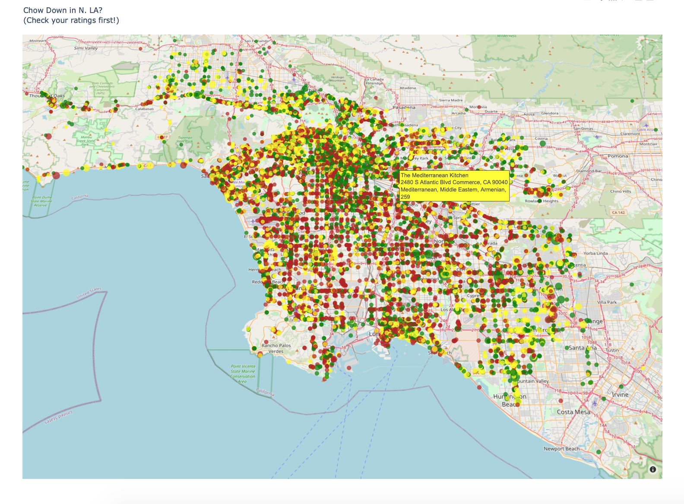
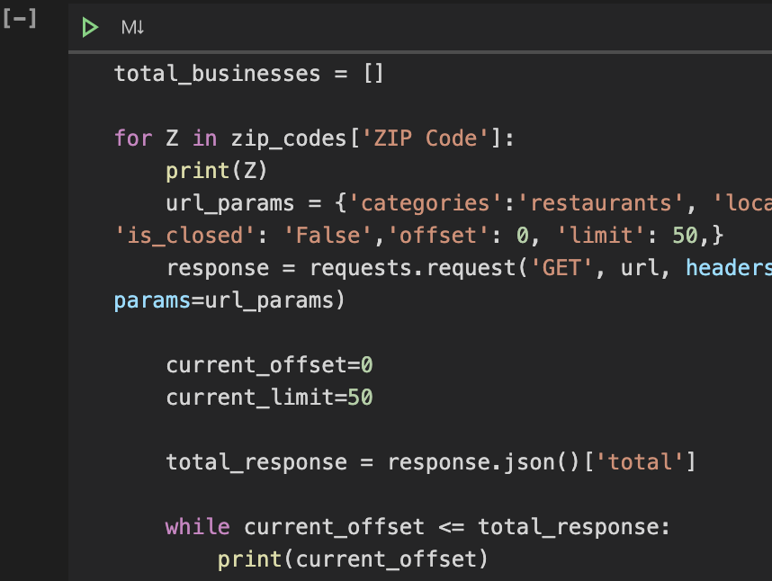
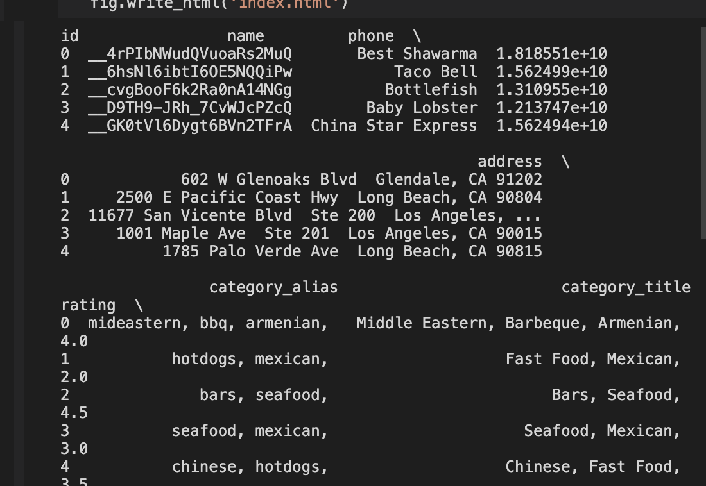

# LA_Restaurants_Yelp_API
Exploring restaurant ratings and reviews using the Yelp Developer API.

### About
Use extracted data from Yelp to create an interactive ratings map of roughly 20,000 eateries in Los Angeles, California. 

### Limitation of the dataset
Yelp API restricts calls to 1000 items. Since Los Angeles County has roughly 30,000 eating establishments, requesting information using the city as a parameter would not have resulted in enough information to provide solid insights since there would have been 1,000 locations out of 30,000. Utilizing zip codes to organize the API requests seemed like a good way to access the majority of locations, however this method did not allow capture of every active location because some are home to more than 1,000 restaurants. Additionally, Yelp's zipcode parameter does not appear to be a strict reference, because some businesses appeared in multiple zip codes.

### Deployed on Github Pages
Click on this <a href='https://sherirosalia.github.io/LA_Restaurants_Yelp_API/'><strong>link </strong></a>to view the interactive projection created in Plotly. Use tilt, rotate and zoom to control vews.

### Sister Project:
Further analysis of this data in this repository <a href="https://www.dropbox.com/s/ro633mn139y1lfc/Screenshot%202020-06-22%2022.17.14.png?dl=0">"stars_of_LA"</a>

### Frameworks
Yelp API, Python, Pandas, Jupyter Notebook, Excel and Plotly. 

### File Structure
- The "notebooks" folder houses the api pull, basic cleanup and a mapping script called chow_by_zip.
- Folder "csv_file" has the api dependent zipcode file, initial api results are in LA_rest_yelp.csv and there is a third with duplicate data removed. 
- The Index file in the root folder is Plotly generated html.
- An alternate mapping script is in the "python" directory.
- Screenshots of the project are in 'images'.

### How to run
You will need to have a Yelp api key, available from their developer program. There are several options for running a notebook such as with an extension in an editor or from command line with "jupyter notebook".

### LA Map

### Script

### Data Pull

