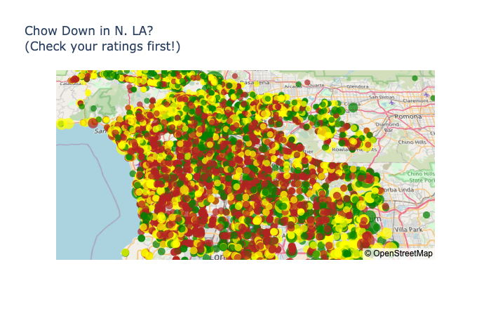

# LA_Restaurants_Yelp_API
Extract and plot 20,000 Los Angeles restaurants using Yelp API, Python and Plotly

### About
Interactive map plot of Los Angeles, CA restaurants that appear on Yelp. The data was retrieved by utilizing the Yelp Developer API </a>. 
### Limitation of the dataset
Yelp API restricts calls to 1000 items per call. Since Los Angeles County has roughly 30,000 eating establishments using zip codes to organize the API requests seems like a good way to access the majority of locations, however Yelp's location search by zipcode is a rather loose term because it seems that many eateries appeared in multiple zip codes. Looping through the 180 zipcodes that started with "920"  retrieved over 130k datapoints of which the vast majority were duplicates. 

### Deployed on Github Pages
Click on this <a href='https://sherirosalia.github.io/LA_Restaurants_Yelp_API/'><strong>link </strong></a>to view the interactive projection created in Plotly. 

### Frameworks
Yelp API, Python, Pandas, Jupyter Notebook, Excel and Plotly. 

### File Structure
- The yelp_api script contains the api call for Yelp which retrieves data based on the zip_codes in the zip code csv.
- Index file is Plotly generated html.
- The geocoding script is in geocode.py.
- The chow_by_zip file creates the Plotly map.
- Data at various stages are in the CSV files.

### LA Map

